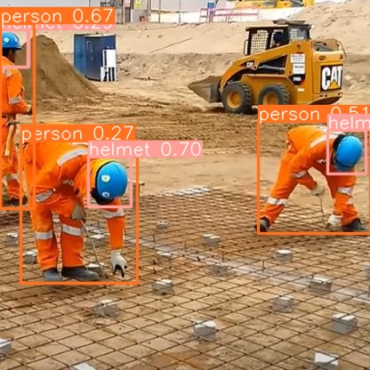

<h1>Helmet Safety Detection using YOLOv10</h1>

<h2>Introduction</h2>

Welcome to our Helmet Safety Detection project, powered by YOLOv10, a cutting-edge object detection algorithm. Our mission is to enhance workplace safety by accurately identifying the presence of safety helmets in various environments. This project focuses on detecting whether workers are wearing helmets in real-time scenarios, offering a crucial tool for ensuring occupational safety standards are met.

<h3>Example:</h3>

    

        

        
<strong>Input</strong>

    

    

        

        
<strong>Result</strong>

    

<h2>Clone the Repository</h2>

Clone the repository and navigate into the project directory:

<pre><code>git clone https://github.com/EbisuRyu/Helmet-Safety-Detection-YOLOv10.git
cd Helmet-Safety-Detection-YOLOv10
</code></pre>

<h2>Installation</h2>

<code>conda</code> virtual environment is recommended.

<pre><code>conda create -n yolov10 python=3.9
conda activate yolov10
</code></pre>

<h2>Requirements</h2>

Install the required packages of YOLOv10 using:

<pre><code>cd yolov10
pip install -r requirements.txt
pip install -e .
</code></pre>
and then install the required packages of this project:
<pre><code>cd ..
pip install -r requirements.txt
</code></pre>

<h2>Training Instructions</h2>

<h3>Configuring Training Parameters</h3>

Modify the training parameters in <code>train.py</code> to suit your specific dataset and training requirements:

<pre><code>python train.py -y ../datasets/safety_helmet_dataset/data.yaml -m ./models/yolov10n.pt -e 50 -s 640 -b 54 -p ./runs/detect
</code></pre>

<strong>Arguments:</strong>

<ul>
    <li><code>-y, --yaml_path:</code> Path to the YAML configuration file for your dataset.</li>
    <li><code>-m, --model_path:</code> Path to the pre-trained YOLOv10 model file.</li>
    <li><code>-e, --epochs:</code> Number of epochs for training.</li>
    <li><code>-s, --imgsize:</code> Image size for training (e.g., 640).</li>
    <li><code>-b, --batch_size:</code> Batch size for training.</li>
    <li><code>-p, --project:</code> Project directory to save training results.</li>
</ul>

<h3>Running the Training</h3>

Execute the following command to start training:

<pre><code>python train.py -y path/to/your/data.yaml -m path/to/pretrained/yolov10_model.pt -e 50 -s 640 -b 54 -p path/to/save/results
</code></pre>

Replace <code>path/to/your/...</code> with the actual paths relevant to your setup.

<h2>Validation Instructions</h2>

<h3>Configuring Validation Parameters</h3>

Modify the validation parameters in <code>validate.py</code> to suit your specific dataset and validation requirements.

<pre><code>python validate.py -m ./runs/detect/train/weights/best.pt -y ../datasets/safety_helmet_dataset/data.yaml -s 640 -t test
</code></pre>

<strong>Arguments:</strong>

<ul>
    <li><code>-m, --model_path:</code> Path to the trained YOLOv10 model file.</li>
    <li><code>-y, --yaml_path:</code> Path to the YAML configuration file for your dataset.</li>
    <li><code>-s, --imgsize:</code> Image size for validation (e.g., 640).</li>
    <li><code>-t, --split:</code> Data split to use for validation (e.g., test, val).</li>
</ul>

<h3>Running the Validation</h3>

Execute the following command to start validation:

<pre><code>python validate.py -m path/to/trained/model.pt -y path/to/your/data.yaml -s 640 -t test
</code></pre>

Replace <code>path/to/your/...</code> with the actual paths relevant to your setup.

<h2>Inference Instructions</h2>

<h3>Configuring Inference Parameters</h3>

Modify the inference parameters in <code>inference.py</code> to specify the model and input/output paths:

<pre><code>python inference.py -m ./models/yolov10n.pt -i ./images/demo/street-view-of-pham-ngu-lao-street--vietnam.jpg -o ./images/results/HCMC_street_predict.png
</code></pre>

<strong>Arguments:</strong>

<ul>
    <li><code>-m, --model_path:</code> Path to the YOLOv10 model file.</li>
    <li><code>-i, --image_path:</code> Path to the input image for inference.</li>
    <li><code>-o, --output_path:</code> Path to save the output image after inference.</li>
</ul>

<h3>Running Inference</h3>

Execute the following command to perform inference on an image:

<pre><code>python inference.py -m path/to/your/model.pt -i path/to/your/input_image.jpg -o path/to/save/output_image.png
</code></pre>

Replace <code>path/to/your/...</code> with the actual paths relevant to your setup.

<h2>Running Streamlit App</h2>

To run the Streamlit app, execute the following command:

<pre><code>streamlit run streamlit_app.py
</code></pre>

This will start the Streamlit server and open the app in your default web browser. Ensure that you have the necessary dependencies installed as specified in the <code>requirements.txt</code> file.

Or you can go to my app deployed on Streamlit using this link: <a href="https://helmet-safety-detection-yolov10.streamlit.app">Deployed Streamlit App</a>

<h2>Acknowledgements</h2>

This project utilizes the YOLOv10 implementation from the <a href="https://github.com/ultralytics/yolov5">YOLOv10 repository</a> by Ultralytics. Special thanks to the contributors and maintainers of that repository.

